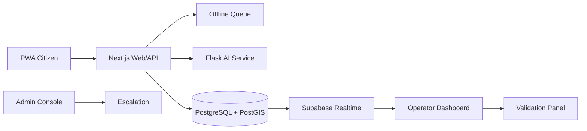
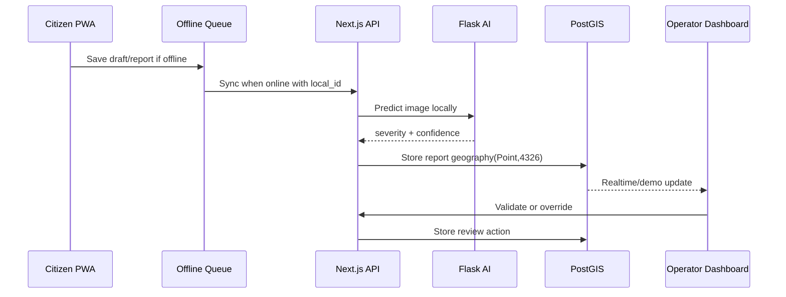

# Technical Architecture

## Layers

- PWA client: Next.js App Router, Tailwind, manifest, offline queue UI.
- Next.js API: demo-mode report, validation, analytics, and export routes.
- Flask AI service: local `/predict`, `/health`, `/model-info`.
- PostgreSQL + PostGIS: migrations define roles, events, damage reports, review log.
- Supabase Storage/Realtime: production path; demo fallback does not require it.
- Demo fallbacks: local demo data, deterministic AI, CSS map panel, CSV/GeoJSON routes.

`DEMO_MODE=true` is the default presentation path. Supabase, Flask, trained model, and map tiles each have a local fallback so the demo can continue when external dependencies fail.
